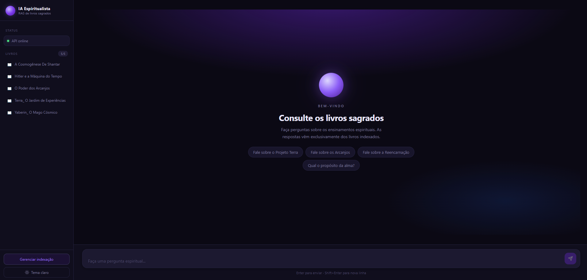

# IA Espiritualista

Sistema de perguntas e respostas baseado em RAG (**Retrieval-Augmented Generation**) sobre livros espiritualistas. A IA responde exclusivamente com base no conteúdo dos livros indexados — sem invenções, sem conhecimento externo.



---

## O que é

Você adiciona PDFs de livros espiritualistas à pasta `livros/`, indexa pelo próprio painel da interface, e passa a ter uma IA que consulta esses livros para responder suas perguntas — citando o livro e a página de origem.

---

## Tecnologias

### Backend
| Tecnologia | Função |
|---|---|
| [FastAPI](https://fastapi.tiangolo.com/) | API REST |
| [LlamaIndex](https://www.llamaindex.ai/) | Orquestração do pipeline RAG |
| [ChromaDB](https://www.trychroma.com/) | Banco vetorial persistente |
| [Ollama](https://ollama.com/) | Execução local dos modelos de IA |
| [Mistral 7B](https://mistral.ai/) | Modelo de linguagem (LLM) |
| [nomic-embed-text](https://ollama.com/library/nomic-embed-text) | Geração de embeddings |
| [PyMuPDF](https://pymupdf.readthedocs.io/) | Extração de texto dos PDFs |

### Frontend
| Tecnologia | Função |
|---|---|
| [React](https://react.dev/) + TypeScript | Interface do usuário |
| [Vite](https://vite.dev/) | Build e dev server |

---

## Requisitos

- Python 3.10+
- Node.js 18+
- [Ollama](https://ollama.com/) instalado e rodando

### Modelos Ollama necessários
```bash
ollama pull mistral
ollama pull nomic-embed-text
```

---

## Como rodar

### 1. Backend

```bash
# Crie e ative o ambiente virtual
python -m venv venv
.\venv\Scripts\activate  # Windows
# source venv/bin/activate  # Linux/Mac

# Instale as dependências
pip install fastapi uvicorn chromadb llama-index llama-index-vector-stores-chroma llama-index-llms-ollama llama-index-embeddings-ollama pymupdf

# Suba a API
uvicorn api:app --reload
```

A API ficará disponível em `http://localhost:8000`.

### 2. Frontend

```bash
cd frontend
npm install
npm run dev
```

O frontend ficará disponível em `http://localhost:5173`.

---

## Como usar

1. Coloque seus PDFs na pasta `livros/`
2. Abra o frontend em `http://localhost:5173`
3. Clique em **"Gerenciar indexação"** na sidebar
4. Clique em **"Indexar livros"** e aguarde o processo terminar
5. Faça perguntas no chat — a IA responde citando o livro e a página

---

## Estrutura do projeto

```
rag-esp-ia/
├── api.py              # API FastAPI principal
├── indexar.py          # Script alternativo de indexação via terminal
├── chat.py             # Chat via terminal (sem frontend)
├── livros/             # Coloque os PDFs aqui (não commitado)
├── banco/              # Dados do ChromaDB (não commitado)
└── frontend/
    └── src/
        ├── App.tsx     # Componente principal
        ├── App.css     # Estilos
        └── index.css   # Variáveis de tema claro/escuro
```

---

## Endpoints da API

| Método | Rota | Descrição |
|---|---|---|
| `POST` | `/chat` | Envia pergunta, recebe resposta |
| `GET` | `/livros` | Lista livros indexados e pendentes |
| `POST` | `/indexar` | Inicia indexação em background |
| `GET` | `/indexar/status` | Status e log da indexação |
| `POST` | `/indexar/resetar` | Limpa o banco e reseta a indexação |
| `GET` | `/debug/contagem` | Total de chunks no banco |
| `GET` | `/debug/busca?q=...` | Testa a busca semântica diretamente |
| `GET` | `/health` | Health check |
